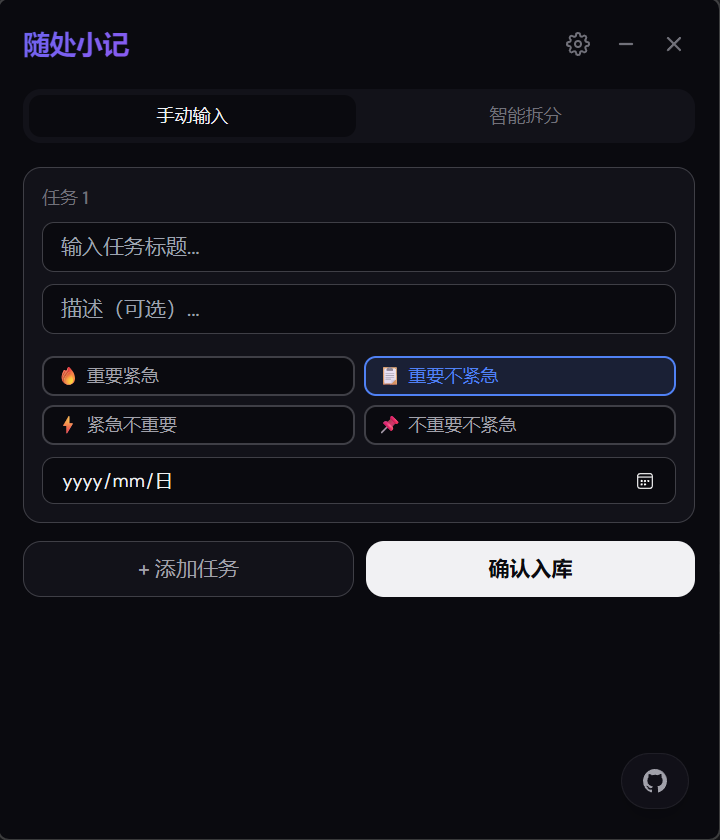

<p align="center">
  
  
</p>

<p align="center">
  <a href="./README.md">中文</a>
</p>

---

## About

**ishwe** is a task management system. It pushes scheduled tasks to designated channels. The product is similar to a todo system, with planned support for multi-platform adaptation including desktop and mobile applications.


---

## Features

- **Quadrant Board** — Drag-and-drop sorting, visual task distribution
- **Smart Auto-Classification** — AI-powered, automatically identifies priority when creating tasks
- **Smart Push** — Scheduled email/webhook/SMS push for daily task summaries
- **Statistics** — Completion rates, quadrant distribution, trend charts
- **Dark Mode** — Light/dark theme toggle
- **i18n** — Chinese and English support


### Upcoming Features

* Quick Note (shortcut key to invoke)


* Android APK - Testing phase
* Other features............

---

## Quick Start

### Local Development

```bash
git clone https://github.com/Pronting/eisenhower.git
cd eisenhower
cp .env.example .env   # Edit .env with JWT_SECRET and optional DEEPSEEK_API_KEY
```

**Backend:**
```bash
cd backend
python -m venv venv && source venv/bin/activate   # Windows: venv\Scripts\activate
pip install -r requirements.txt
uvicorn app.main:app --reload --port 8000
```

**Frontend:**
```bash
cd frontend
npm install
npm run dev
```


### Docker Compose

```bash
cp .env.example .env   # Edit config
docker compose up -d
```

---

## Production Deployment


### Deployment Steps

**1. Clone the repo**
```bash
git clone https://github.com/Pronting/eisenhower.git /opt/ishwe
cd /opt/ishwe
```

**2. Configure environment**
```bash
cp .env.example .env
vim .env
```

```env
JWT_SECRET=<generate with openssl rand -hex 32>
DEEPSEEK_API_KEY=<optional, for AI features>
RESEND_API_KEY=<optional, for email push>
```

**3. Build and start**
```bash
docker compose up -d --build
```

**4. Configure reverse proxy**

Nginx example:
```nginx
server {
    listen 80;
    server_name your-domain.com;

    location / {
        proxy_pass http://127.0.0.1:3000;
        proxy_set_header Host $host;
        proxy_set_header X-Real-IP $remote_addr;
    }

    location /api/ {
        proxy_pass http://127.0.0.1:8000;
        proxy_set_header Host $host;
        proxy_set_header X-Real-IP $remote_addr;
    }
}
```


## Environment Variables

| Variable | Required | Description |
|---|:---:|---|
| `JWT_SECRET` | Yes | JWT authentication secret |
| `DEEPSEEK_API_KEY` | No | DeepSeek API key (AI features) |
| `RESEND_API_KEY` | No | Resend email service key |
| `DATABASE_URL` | No | Database URL (default: SQLite) |

---

## API Overview

Full docs: http://localhost:8000/docs (after starting backend)

---

## Project Structure

```
ishwe/
├── frontend/          # Next.js frontend
│   └── src/
│       ├── app/       # Pages (dashboard, archive, stats, settings)
│       ├── components/# UI components
│       └── i18n/      # Internationalization
├── backend/           # FastAPI backend
│   ├── app/
│   │   ├── api/       # Routes
│   │   ├── agent/     # AI modules
│   │   ├── models/    # Data models
│   │   └── services/  # Business logic
│   └── tests/         # Tests
├── docker-compose.yml
└── .env.example
```

---
